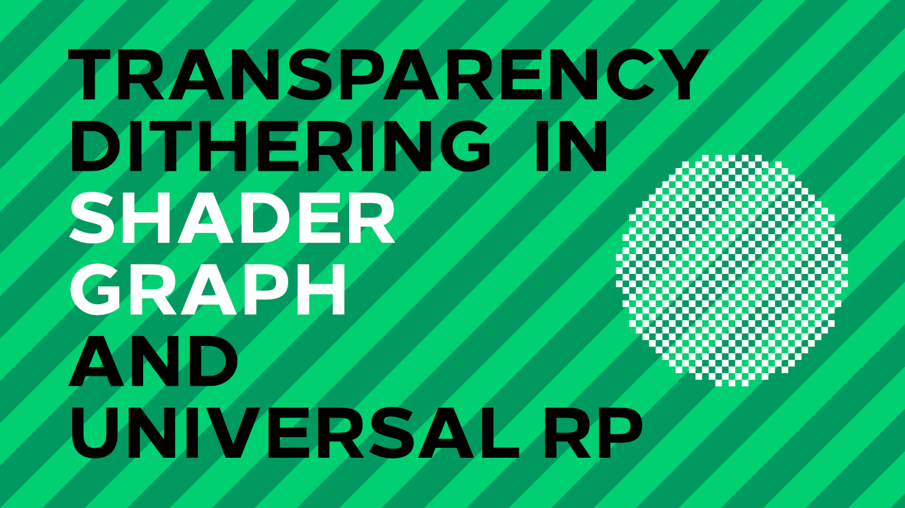

# Dither Transparency in Unity URP

A dither transparency shader for Unity's Shader Graph and Universal Render Pipeline.

## Overview

This project features an efficient dither tarnsparency shader which uses a world-space Bayer dither matrix to cull object pixels to 'fake' a transparency-like effect without the need to implement actual transparency. It uses the features of Shader Graph and Universal RP. An accompanying tutorial is available on [danielilett.com](https://danielilett.com/2020-04-19-tut5-5-urp-dither-transparency/).

## Software

This project was created using Unity 2019.3.0f6 and Universal Render Pipeline 7.1.8.

## Authors

This project and the corresponding tutorial series were written by Daniel Ilett. [Follow him on Twitter](https://twitter.com/daniel_ilett) for more gamedev tutorials!

## Release

This project was released on April 19th 2020. 
